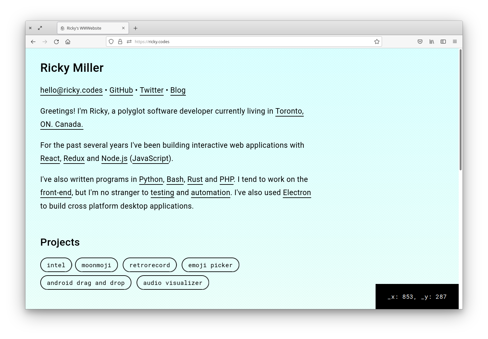

[](https://github.com/rickycodes/www/actions)  [](https://app.fossa.com/projects/git%2Bgithub.com%2Frickycodes%2Fwww?ref=badge_shield)

# <a href='https://ricky.codes'>ricky.codes</a>  

```
   +---------------+
   |.-------------.|
   ||    ricky    ||
   ||     dot     ||
   ||    codes    ||
   ||$ ./build.sh ||
   |+-------------+|
   +-..---------..-+
   .---------------.
  / /=============\ \
 / /===============\ \
/_____________________\
\_____________________/
```

My personal website built with <a href='http://rust-lang.org/'>Rust</a> using <a href='https://github.com/koute/cargo-web'>cargo-web</a> and <a href='https://github.com/koute/stdweb'>stdweb</a>



## Disclaimer

<a href='https://github.com/koute/stdweb'>stdweb</a> seems to be now defunct (hasn't been updated since 2019). You might be better off exploring alternatives like <a href='https://rustwasm.github.io/wasm-bindgen/'> wasm bingen</a>. That's what everyone else <a href='https://github.com/yewstack/yew/pull/1697'>is doing</a>.

If you still want to play with this I am building it on `nightly-2019-08-01-x86_64-unknown-linux-gnu` re: <a href='https://github.com/rickycodes/www/issues/8#issuecomment-782784044'>#8</a>

## Build
you will need <a href='https://github.com/koute/cargo-web'>`cargo web`</a>

```
cargo web build --target=wasm32-unknown-unknown
```
or you can use the handy <a href='./build.sh'>build script</a>:
```
bash build.sh
```
I haven't tested other targets, but <a href='https://emscripten.org'>emscripten</a> should work

You should see something like:  
```
warning: debug builds on the wasm32-unknown-unknown are currently totally broken
         forcing a release build
    Finished release [optimized] target(s) in 0.0 secs
```
## Running local web server
```
cargo web start --target=wasm32-unknown-unknown
```
or you can use the handy <a href='./build.sh'>build script</a>:
```
bash build.sh --serve
```
You should see something like:  
```
warning: debug builds on the wasm32-unknown-unknown are currently totally broken
         forcing a release build
    Finished release [optimized] target(s) in 0.0 secs

If you need to serve any extra files put them in the 'static' directory
in the root of your crate; they will be served alongside your application.
You can also put a 'static' directory in your 'src' directory.

Your application is being served at '/rickycodes.js'. It will be automatically
rebuilt if you make any changes in your code.

You can access the web server at `http://[::1]:8000`.
```
## License

Licensed under

  * MIT license ([LICENSE](LICENSE) or http://opensource.org/licenses/MIT)


[](https://app.fossa.com/projects/git%2Bgithub.com%2Frickycodes%2Fwww?ref=badge_large)
