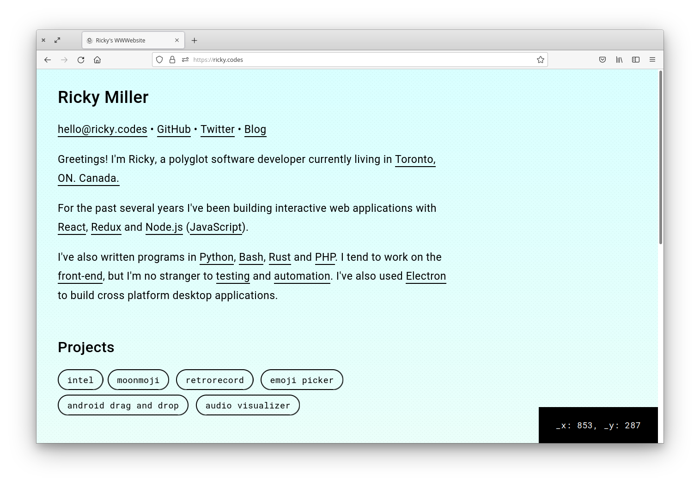

[](https://github.com/rickycodes/www/actions) [](https://github.com/rickycodes/www/actions/workflows/shellcheck.yml) [](https://app.fossa.com/projects/git%2Bgithub.com%2Frickycodes%2Fwww?ref=badge_shield)

# <a href='https://ricky.codes'>ricky.codes</a>

```
   +---------------+
   |.-------------.|
   ||    ricky    ||
   ||     dot     ||
   ||    codes    ||
   ||$ ./build.sh ||
   |+-------------+|
   +-..---------..-+
   .---------------.
  / /=============\ \
 / /===============\ \
/_____________________\
\_____________________/
```

My personal website, built with <a href='https://www.rust-lang.org/'>Rust</a>, <a href='https://github.com/wasm-bindgen/wasm-bindgen'>wasm-bindgen</a>, and <a href='https://wasm-bindgen.github.io/wasm-bindgen/web-sys/index.html'>web-sys</a>.



## Prerequisites

The repository pins stable Rust and the `wasm32-unknown-unknown` target in `rust-toolchain.toml`. Install the matching WebAssembly packager and the Node build tools:

```sh
cargo install wasm-bindgen-cli --version 0.2.128 --locked
npm ci
```

`wasm-strip` from WABT and `wasm-opt` from Binaryen are optional local optimizers. The build continues when either one is unavailable.

## Build

Generate the static HTML, compile Rust, package the browser-ready ES module, and minify the JavaScript:

```sh
./build.sh
```

The deployable site is written to `target/deploy`. Individual phases are also available:

```sh
./build.sh --generate
./build.sh --build-wasm
./build.sh --minify
./build.sh --test
```

## Run locally

```sh
./build.sh --watch
```

This builds the site and serves `target/deploy` at `http://127.0.0.1:8000`. If `watchexec` is installed, changes under `src` and `static` trigger a rebuild.

## License

Licensed under the MIT license ([LICENSE](LICENSE) or <https://opensource.org/licenses/MIT>).

[](https://app.fossa.com/projects/git%2Bgithub.com%2Frickycodes%2Fwww?ref=badge_large)
